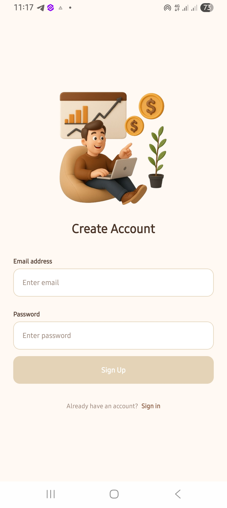
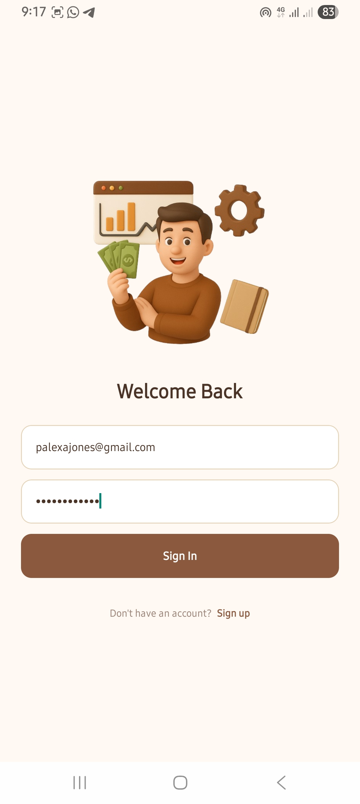
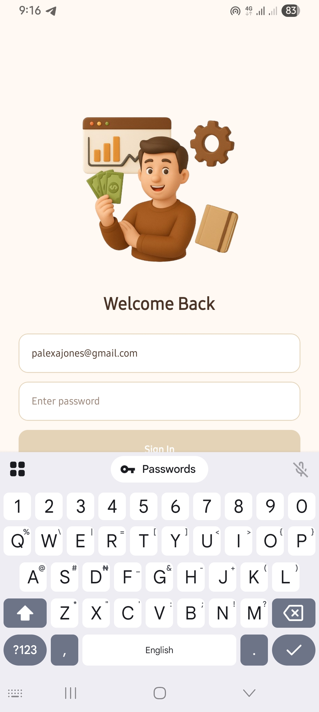
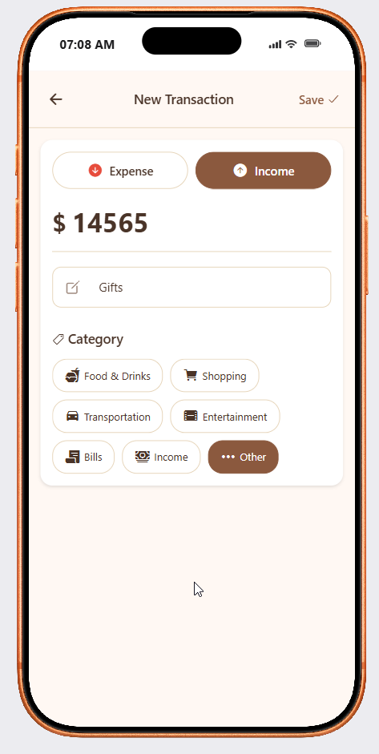
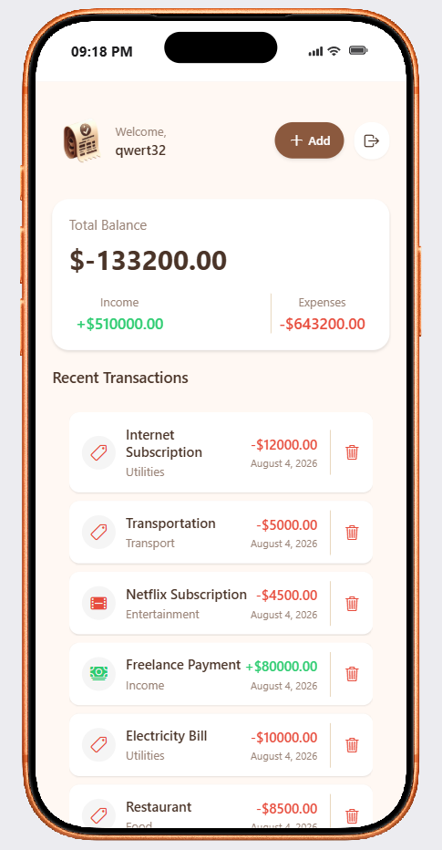
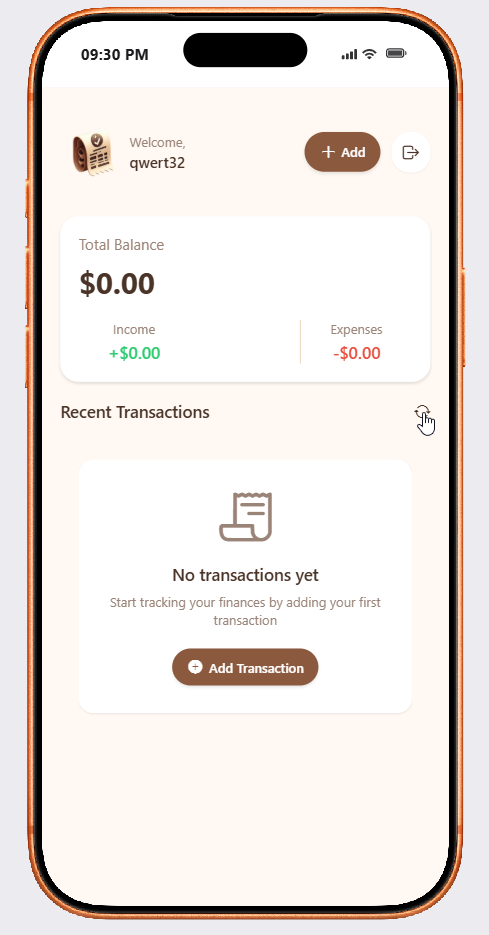
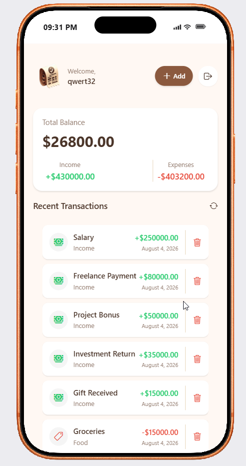
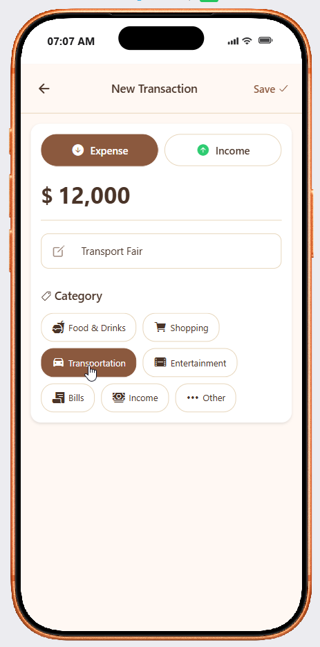

# 💸 Expense Tracker Mobile App

> A sleek, high-performance, cross-platform mobile application for tracking personal expenses, managing budgets, and analyzing financial activity in real-time. Built with **React Native**, **Expo**, **Expo Router**, and **Clerk Authentication**.

---

## 🌟 Key Features

* **🔐 Secure Authentication**  
  Powered by **Clerk** with persistent session token caching via `expo-secure-store`. Supports email/password authentication with sign-in and sign-up flows.

* **📊 Live Balance & Analytics Overview**  
  Dynamic financial dashboard featuring a real-time summary card displaying total balance, total income, and total expenses at a glance.

* **➕ Instant Transaction Management**  
  Effortlessly log income or expense transactions with formatted amounts, custom notes, and automatic date recording.

* **🏷️ Smart Categorization**  
  Organize spending with built-in categories such as *Food & Drinks*, *Shopping*, *Transportation*, *Entertainment*, *Bills*, *Income*, and *Other*, each equipped with custom icons.

* **🗑️ Interactive Actions & Confirmations**  
  Delete transactions seamlessly with native confirmation dialogs tailored for iOS, Android, and Web platforms.

* **🔄 Refresh & Real-Time Sync**  
  Pull-to-refresh list support and background synchronization with the production backend API on Render.

* **📱 Multi-Platform Support**  
  Fully optimized and responsive interface across **iOS**, **Android**, and **Web**.

---

## 🛠️ Tech Stack

* **Core Framework:** [React Native](https://reactnative.dev/) (v0.86) + [Expo](https://expo.dev/) (v57)
* **Routing:** [Expo Router](https://docs.expo.dev/router/introduction/) (File-based typed routing)
* **Authentication:** [@clerk/expo](https://clerk.com/) with `expo-secure-store`
* **Icons & Vector Graphics:** `@expo/vector-icons` (Ionicons) & `expo-symbols`
* **Styling & UI:** Custom styling, SafeArea handling, and Glassmorphism effects (`expo-glass-effect`)
* **State Management:** Custom React hooks (`useTransactions`)
* **JS Engine:** Hermes Engine

---

## 📄 License

This project is licensed under the [MIT License](LICENSE).

---

## 📱 Screenshots

| | |
| :---: | :---: |
|  |  |
|  |  |
|  |  |
|  |  |
|  | |

